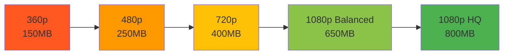
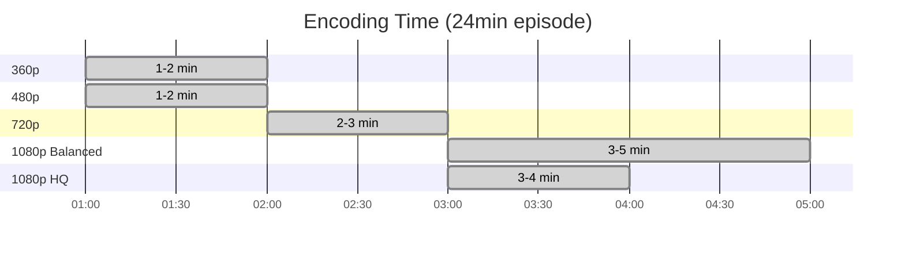
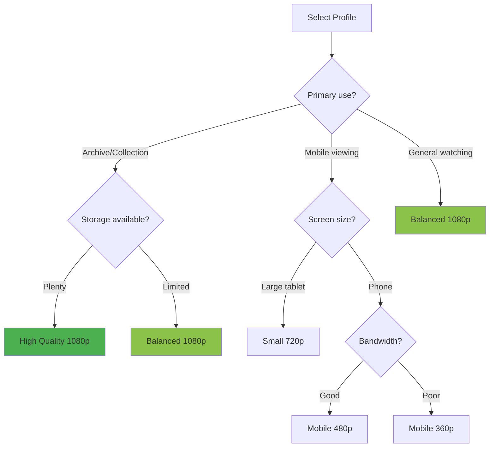

# Encoding Profiles

Detailed guide to all available encoding profiles and their use cases.

## Available Profiles

### High Quality 1080p

**Best for**: Archival, maximum visual quality, source material preservation

```python
SELECTED_PROFILE = "High Quality 1080p"
```

| Parameter | Value | Description |
|-----------|-------|-------------|
| Resolution | 1080p | Full HD output |
| CRF/QP | 22 | Very high quality |
| Audio Codec | Opus | Modern, efficient |
| Audio Bitrate | 160k | High fidelity |
| File Size | ~800 MB | 24min episode |
| Speed (GPU) | 3-4 min | Moderate |

**Characteristics**:

- Virtually transparent to source
- Minimal compression artifacts
- Preserves fine details and textures
- Smooth gradients (10-bit color)
- Best for archiving or redistribution

::: example Use Case
Archiving Blu-ray rips or creating a permanent collection of favorite series.

---

### Balanced 1080p (Recommended)

**Best for**: General use, everyday watching, streaming quality

```python
SELECTED_PROFILE = "Balanced 1080p"
```

| Parameter | Value | Description |
|-----------|-------|-------------|
| Resolution | 1080p | Full HD output |
| CRF/QP | 24 | High quality |
| Audio Codec | Opus | Modern, efficient |
| Audio Bitrate | 128k | Very good |
| File Size | ~650 MB | 24min episode |
| Speed (GPU) | 3-5 min | Fast |

**Characteristics**:

- Excellent quality/size balance
- Imperceptible quality loss for most anime
- Suitable for streaming and download
- Fast encoding with GPU

::: success Recommended
This is the **default recommended profile** for most users. Perfect balance of quality, size, and speed.

---

### Small 720p

**Best for**: Space saving while maintaining good quality

```python
SELECTED_PROFILE = "Small 720p"
```

| Parameter | Value | Description |
|-----------|-------|-------------|
| Resolution | 720p | HD output |
| CRF/QP | 26 | Good quality |
| Audio Codec | Opus | Modern, efficient |
| Audio Bitrate | 112k | Good |
| File Size | ~400 MB | 24min episode |
| Speed (GPU) | 2-3 min | Very fast |

**Characteristics**:

- 40% smaller than 1080p
- Still looks great on most screens
- Ideal for laptops and tablets
- Very fast encoding

::: tip Sweet Spot
720p offers the best quality-per-megabyte ratio. Perfect for large collections.

---

### Mobile 480p

**Best for**: Mobile devices, low bandwidth, very large collections

```python
SELECTED_PROFILE = "Mobile 480p"
```

| Parameter | Value | Description |
|-----------|-------|-------------|
| Resolution | 480p | SD+ output |
| CRF/QP | 28 | Decent quality |
| Audio Codec | Opus | Modern, efficient |
| Audio Bitrate | 96k | Acceptable |
| File Size | ~250 MB | 24min episode |
| Speed (GPU) | 1-2 min | Ultra fast |

**Characteristics**:

- Perfect for phones and tablets
- Low bandwidth streaming
- Quick downloads over cellular
- Acceptable quality on small screens

::: info Mobile Viewing
On a 5-7 inch phone screen, 480p looks perfectly fine. Great for commutes and travel.

---

### Mobile 360p

**Best for**: Ultra-low bandwidth, maximum space efficiency

```python
SELECTED_PROFILE = "Mobile 360p"
```

| Parameter | Value | Description |
|-----------|-------|-------------|
| Resolution | 360p | Low resolution |
| CRF/QP | 30 | Lower quality |
| Audio Codec | Opus | Modern, efficient |
| Audio Bitrate | 96k | Acceptable |
| File Size | ~150 MB | 24min episode |
| Speed (GPU) | 1-2 min | Ultra fast |

**Characteristics**:

- Smallest file size
- Works on very slow connections
- Suitable for small screens only
- Maximum episodes per GB

::: warning Quality Trade-off
360p is noticeably lower quality on larger screens. Use only when size is critical.

---

## Profile Comparison

### Visual Quality vs File Size



### Episodes per 10GB

| Profile | Episodes | Total Runtime |
|---------|----------|---------------|
| High Quality 1080p | ~12 episodes | ~5 hours |
| Balanced 1080p | ~15 episodes | ~6 hours |
| Small 720p | ~25 episodes | ~10 hours |
| Mobile 480p | ~40 episodes | ~16 hours |
| Mobile 360p | ~68 episodes | ~27 hours |

### Encoding Speed Comparison

Based on T4 GPU (Free Colab):



## Choosing the Right Profile

### Decision Tree



### Recommendations by Use Case

#### 🏆 Best Overall: Balanced 1080p

Perfect for:

- Daily anime watching
- Streaming from Drive
- Sharing with friends
- Mixed device usage (PC + mobile)

#### 💎 Best Quality: High Quality 1080p

Perfect for:

- Archiving favorite series
- Blu-ray rip encoding
- Future-proofing collection
- Large screen viewing (TV, projector)

#### 💾 Best Size/Quality: Small 720p

Perfect for:

- Large collections (100+ GB)
- Laptop viewing
- Balanced mobile/PC use
- Limited storage

#### 📱 Best Mobile: Mobile 480p

Perfect for:

- Phone/tablet exclusive viewing
- Download for offline watching
- Cellular data streaming
- Travel and commutes

## Technical Details

### Video Encoding

#### GPU (NVENC) Settings

```
Codec: hevc_nvenc
Preset: p7 (highest quality preset)
Tune: hq (high quality mode)
Color: 10-bit (yuv420p10le)
Rate Control: VBR (Variable Bitrate)
Lookahead: 48 frames
```

Benefits:

- 5-10x faster than CPU
- Very good quality
- Hardware acceleration
- Low CPU usage

#### CPU (x265) Settings

```
Codec: libx265
Preset: slow
CRF: Profile-dependent
10-bit color depth
Psycho-visual optimizations:
  - aq-mode=3
  - psy-rd=2.0
  - psy-rdoq=2.0
```

Benefits:

- Best possible quality
- Better compression efficiency
- Fine-grained control
- No GPU required

### Audio Encoding

All profiles use **Opus** codec:

```
Codec: libopus
Channels: Stereo (2.0)
VBR: Enabled
Bitrate: Profile-dependent (96k-160k)
```

Why Opus?

- Better quality than AAC at same bitrate
- Modern codec (2012)
- Excellent for voice and music
- Widely supported

### Color Processing

All profiles maintain:

```
Color Primaries: BT.709
Transfer: BT.709
Colorspace: BT.709
Bit Depth: 10-bit
```

Benefits:

- Prevents banding in gradients
- Preserves color accuracy
- Standard for HD content
- Better than 8-bit

## Customizing Profiles

Want to modify a profile? See [Custom Profiles Guide](advanced/custom-profiles.md).

Example:

```python
# Create a custom variant
PROFILES["My Custom"] = {
"height": 900,  # Between 720p and 1080p
"crf_qp": 23,
"audio": "libopus",
"audio_bitrate": "128k"
}

SELECTED_PROFILE = "My Custom"
```

---

::: question Still Unsure?
Check our [FAQ](faq.md) or start with **Balanced 1080p** - you can't go wrong!
